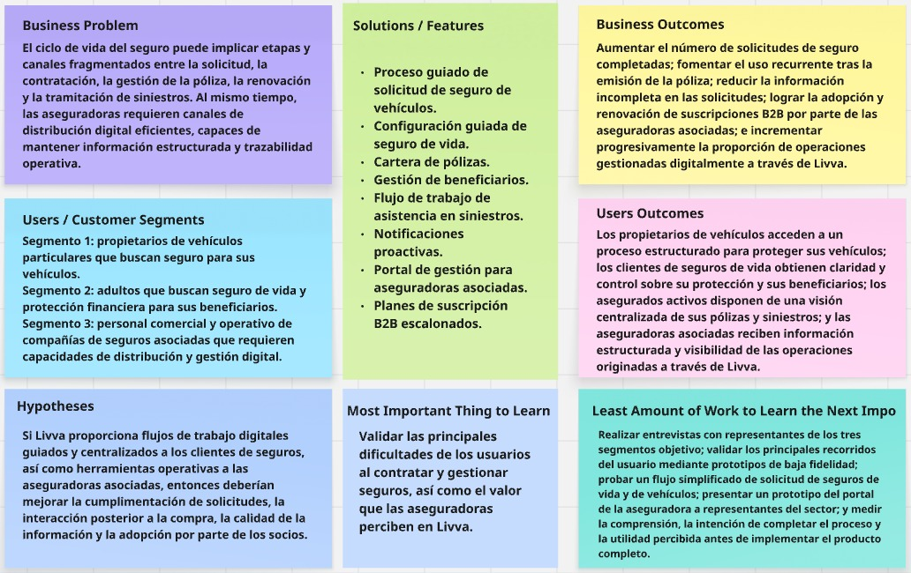

#### UNIVERSIDAD PERUANA DE CIENCIAS APLICADAS
### FACULTAD DE INGENIERÍA
### PROGRAMA ACADÉMICO DE INGENIERÍA DE SOFTWARE

**Ciclo:** 2026-20
 
**Curso:** 1AS10730 Aplicaciones Web
 
**NRC:** 8168
 
**Docente:** Alex Humberto Sánchez Ponce

---
# INFORME DE TRABAJO FINAL

**Nombre de la Startup:** Livva

**Nombre del producto:** AuraFarming

## Integrantes
| Código | Apellidos y Nombres | Carrera |
| :--- | :--- | :--- |
| U202321613 | Paredes Chavez, Carlos Augusto | Ingeniería de Software |
| U202323369 | Torres Diaz, Rolando Andre | Ingeniería de Software |
| U202418623 | Contreras Panuera, Fernando Fabrizio | Ingeniería de Software |
| U202416147 | Cespedes Lezcano, Carlos Gabriel | Ingeniería de Software |
| Pon tu código p | Rivera Aguilar, Scarlet Josefina | Ingeniería de Software |

**Fecha:** Setiembre, 2026

## Registro de versiones del informe
| Versión | Fecha | Autor | Descripción de modificación |
|:---:|:---:|:---:|:---|
| 1.0 | - | - | - |
| 1.1 | - | - | - |
| 1.2 | - | - | - |
| 1.3 | - | - | - |
---

## Project Report Collaboration Insights

	
[Repositorio de documentacion](https://github.com/CarlossUPC/upc-pre-202620-1asi0730-8168-Livva-report-tb1)  
<!--- Tabla inside de colaboradores    --->

<!--- [Repositorio del Landing Page](https://github.com/ApoutCoffees/SmilingCups-Landing-Page)   --->
<!--- Tabla inside de colaboradores    --->

<!--- [Repositorio del Fronted](https://github.com/ApoutCoffees/SmilingCups-Fronted) --->
<!--- Tabla inside de colaboradores    --->

<!--- [Repositorio del Backend](https://github.com/ApoutCoffees/SmilingCups-Backend) --->
<!--- Tabla inside de colaboradores    --->

---

# Tabla de Contenido

[Student Outcome](#student-outcome)
1. [Capítulo I: Introducción](#capítulo-i-introducción)
	- 1.1. [Startup Profile](#11-startup-profile) 
		- 1.1.1. [Descripción de la Startup](#111-descripción-de-la-startup)
		- 1.1.2. [Perfiles de integrantes del equipo](#112-perfiles-de-integrantes-del-equipo)
	- 1.2. [Solution Profile](#12-solution-profile)
		- 1.2.1 [Antecedentes y problemática](#121-antecedentes-y-problemática)
		- 1.2.2 [Lean UX Process](#122-lean-ux-process)
			- 1.2.2.1. [Lean UX Problem Statements](#1221-lean-ux-problem-statements)
			- 1.2.2.2. [Lean UX Assumptions](#1222-lean-ux-assumptions)
			- 1.2.2.3. [Lean UX Hypothesis Statements](#1223-lean-ux-hypothesis-statements)
			- 1.2.2.4. [Lean UX Canvas](#1224-lean-ux-canvas)
	- 1.3. [Segmentos objetivo](#13-segmentos-objetivo)
2. [Capítulo II: Requirements Elicitation & Analysis](#capítulo-ii-requirements-elicitation--analysis)
	- 2.1. [Competidores](#21-competidores)
		- 2.1.1. [Análisis competitivo](#211-análisis-competitivo)
		-  2.1.2. [Estrategias y tácticas frente a competidores](#212-estrategias-y-tácticas-frente-a-competidores)
	- 2.2. [Entrevistas](#22-entrevistas)
		-  2.2.1. [Diseño de entrevistas](#221-diseño-de-entrevistas)
		- 2.2.2. [Registro de entrevistas](#222-registro-de-entrevistas)
		- 2.2.3. [Análisis de entrevistas](#223-análisis-de-entrevistas)
	-  2.3. [Needfinding](#23-needfinding)
		- 2.3.1. [User Personas](#231-user-personas)
		- 2.3.2. [User Task Matrix](#232-user-task-matrix)
		- 2.3.3. [User Journey Mapping](#233-user-journey-mapping)
		- 2.3.4. [Empathy Mapping](#234-empathy-mapping)
	- 2.4. [Big Picture Event Storming](#24-big-picture-event-storming)
	- 2.5. [Ubiquitous Language](#25-ubiquitous-language)
3. [Capítulo III: Requirements Specification](#capítulo-iii-requirements-specification)
	- 3.1. [To-Be Scenario Mapping](#31-to-be-scenario-mapping)
	- 3.2. [User Stories](#32-user-stories)
	- 3.3. [Impact Mapping](#33-impact-mapping)
	- 3.4. [Product Backlog](#34-product-backlog)
4. [Capítulo IV: Product Design](#capitulo-iv-product-design)
	- 4.1. [Style Guidelines](#41-style-guidelines)
		- 4.1.1. [General Style Guidelines](#411-general-style-guidelines)
		- 4.1.2. [Web Style Guidelines](#412-web-style-guidelines)
	- 4.2. [Information Architecture](#42-information-architecture)
		- 4.2.1. [Organization Systems](#421-organization-systems)
		- 4.2.2. [Labeling Systems](#422-labeling-systems)
		- 4.2.3. [SEO Tags and Meta Tags](#423-seo-tags-and-meta-tags)
		- 4.2.4. [Searching Systems](#424-searching-system)
		- 4.2.5. [Navigation Systems](#425-navigation-systems)
	- 4.3. [Landing Page UI Design](#43-landing-page-ui-design)
		- 4.3.1. [Landing Page Wireframe](#431-landing-page-wireframe)
		- 4.3.2. [Landing Page Mock-up](#432-landing-page-mock-up)
	- 4.4. [Web Applications UX/UI Design](#44-web-applications-uxui-design)
		- 4.4.1. [Web Applications Wireframes](#441-web-applications-wireframes)
		- 4.4.2. [Web Applications Wireflow Diagrams](#442-web-applications-wireflow-diagrams)
		- 4.4.3. [Web Applications Mock-ups](#443-web-applications-mock-ups)
		- 4.4.4. [Web Applications User Flow Diagrams](#444-web-applications-user-flow-diagrams)
	- 4.5. [Web Applications Prototyping](#45-web-applications-prototyping)
	- 4.6. [Domain-Driven Software Architecture](#46-domain-driven-software-architecture)
		- 4.6.1. [Design-Level EventStorming](#461-design-level-event-storming)
		- 4.6.2. [Software Architecture Context Diagram](#462-software-architecture-context-diagram)
		- 4.6.3. [Software Architecture Container Diagrams](#463-software-architecture-container-diagrams)
		- 4.6.4. [Software Architecture Components Diagram](#464-software-architecture-components-diagrams)
	-  4.7. [Software Object-Oriented Design](#47-software-object-oriented-design)
		- 4.7.1. [Class Diagrams](#471-class-diagrams)
	- 4.8. [Database Design](#48-database-design)
		-  4.8.1. [Database Diagrams](#481-database-diagrams)
5. [Capítulo V: Product Implementation, Validation & Deployment](#capitulo-v-product-implementation-validation--deployment)
	- 5.1. [Software Configuration Management](#51-software-configuration-management)
		- 5.1.1. [Software Development Environment Configuration](#511-software-development-environment-configuration)
		- 5.1.2. [Source Code Management](#512-source-code-management)
		- 5.1.3. [Source Code Style Guide & Conventions](#513-source-code-style-guide--conventions)
		- 5.1.4. [Software Deployment Configuration](#514-software-deployment-configuration)
	- 5.2. [Landing Page, Services & Applications Implementation](#52-landing-page-services--applications-implementation)
		- 5.2.1. [Sprint 1](#521-sprint-1)
			- 5.2.1.1. [Sprint Planning 1](#5211-sprint-planning-1)
			- 5.2.1.2. [Aspect Leaders and Collaborators](#5212-aspect-leaders-and-collaborators)
			- 5.2.1.3. [Sprint Backlog 1](#5213-sprint-backlog-1)
			- 5.2.1.4. [Development Evidence for Sprint Review](#5214-development-evidence-for-sprint-review)
			- 5.2.1.5. [Execution Evidence for Sprint Review](#5215-execution-evidence-for-sprint-review)
			- 5.2.1.6. [Services Documentation Evidence for Sprint Review](#5216-services-documentation-evidence-for-sprint-review)
			- 5.2.1.7. [Software Deployment Evidence for Sprint Review](#5217-software-deployment-evidence-for-sprint-review)
			- 5.2.1.8. [Team Collaboration Insights during Sprint](#5218-team-collaboration-insights-during-sprint)
   - - 5.2.2. [Sprint 2](#522-sprint-2)
			- 5.2.2.1. [Sprint Planning 2](#5221-sprint-planning-2)
			- 5.2.2.2. [Aspect Leaders and Collaborators](#5222-aspect-leaders-and-collaborators)
			- 5.2.2.3. [Sprint Backlog 2](#5223-sprint-backlog-2)
			- 5.2.2.4. [Development Evidence for Sprint Review](#5224-development-evidence-for-sprint-review)
			- 5.2.2.5. [Execution Evidence for Sprint Review](#5225-execution-evidence-for-sprint-review)
			- 5.2.2.6. [Services Documentation Evidence for Sprint Review](#5226-services-documentation-evidence-for-sprint-review)
			- 5.2.2.7. [Software Deployment Evidence for Sprint Review](#5227-software-deployment-evidence-for-sprint-review)
			- 5.2.2.8. [Team Collaboration Insights during Sprint](#5228-team-collaboration-insights-during-sprint)
		- **5.2.3. [Sprint 3](#523-sprint-3)**
			- 5.2.3.1. [Sprint Planning 3](#5231-sprint-planning-3)
			- 5.2.3.2. [Aspect Leaders and Collaborators](#5232-aspect-leaders-and-collaborators)
			- 5.2.3.3. [Sprint Backlog 3](#5233-sprint-backlog-3)
			- 5.2.3.4. [Development Evidence for Sprint Review](#5234-development-evidence-for-sprint-review)
			- 5.2.3.5. [Execution Evidence for Sprint Review](#5235-execution-evidence-for-sprint-review)
			- 5.2.3.6. [Services Documentation Evidence for Sprint Review](#5236-services-documentation-evidence-for-sprint-review)
			- 5.2.3.7. [Software Deployment Evidence for Sprint Review](#5237-software-deployment-evidence-for-sprint-review)
			- 5.2.3.8. [Team Collaboration Insights during Sprint](#5238-team-collaboration-insights-during-sprint)
	- **5.3. [Validation Interviews](#53-validation-interviews)**
		- 5.3.1. [Diseño de Entrevistas](#531-diseño-de-entrevistas)
		- 5.3.2. [Registro de Entrevistas](#532-registro-de-entrevistas)
		- 5.3.3. [Evaluaciones según heurísticas](#533-evaluaciones-según-heurísticas)
	- **5.4. [Video About-the-Product](#54-video-about-the-product)**
      
	[Conclusiones](#conclusiones)

	[Bibliografía](#bibliografía)

	[Anexos](#anexos)

# Student Outcome

| Criterio específico | Acciones realizadas | Conclusiones |
| :--- | :--- | :--- |
| **Trabaja en equipo para proporcionar liderazgo en forma conjunta** | **Nombre Completo de Alumno** **TB1:**  **TP1:**  **TB2:**  **TF1:**    |  |
| **Crea un entorno colaborativo e inclusivo, establece metas, planifica tareas y cumple objetivos** | **Nombre Completo de Alumno** **TB1:**  **TP1:**  **TB2:**  **TF1:**    |  |
---

# Capítulo I: Introducción
## 1.1. Startup Profile

### 1.1.1. Descripción de la Startup

Livva es una startup peruana de base tecnológica orientada al sector InsurTech, enfocada en digitalizar la intermediación y gestión de seguros de vida y seguros vehiculares. La startup plantea operar como un bróker digital de seguros, facilitando la relación entre los usuarios y las compañías aseguradoras asociadas durante procesos como la solicitud, contratación, consulta de pólizas, renovaciones y gestión de siniestros o indemnizaciones.

La plataforma busca centralizar estos procesos en una experiencia web accesible y trazable. Livva no asume directamente el riesgo ni emite las pólizas, ya que estas responsabilidades corresponden a las compañías aseguradoras asociadas.

Misión: facilitar el acceso y la gestión de seguros mediante una experiencia digital clara, accesible y centralizada que acompañe a los usuarios durante el ciclo de vida de su protección.

Visión: consolidarse como una plataforma InsurTech referente en el mercado peruano, reconocida por transformar la manera en que las personas y las aseguradoras interactúan durante la contratación y gestión de seguros.

El modelo de negocio de Livva combina los ingresos derivados de la intermediación de seguros con un modelo de suscripción B2B dirigido a compañías aseguradoras asociadas. Mediante estas suscripciones, las aseguradoras podrán acceder a funcionalidades de distribución digital, seguimiento de operaciones y herramientas de gestión dentro de la plataforma, con diferentes niveles de servicio según el plan contratado.

### 1.1.2. Perfiles de integrantes del equipo 

| Integrante                       | Código     | Carrera / Información                                                                 |
|----------------------------------|------------|----------------------------------------------------------------------------------------|
| Rivera Aguilar, Scarlet Josefina | tu codigo p | Ingeniería de Software. Conocimiento en Vue y SQL. |
| Céspedes Lezcano, Carlos Gabriel | u202416147 | Ingeniería de Software. Conocimientos en C++, Git, CSS y JavaScript |
| Paredes Chavez, Carlos Augusto | u202321613 | Ingeniería de Software. Conocimientos en HTML, SQL y C#.                          |
| Contreras Panuera, Fernando Fabrizio  | u202418623 | Ingenieria de Software. Conocimientos en CSS, redes y Vue.  |
| Torres Diaz, Rolando Andre | u202323369 | Ingeniería de Software. Conocimientos en Git, Vue y C#. |

## 1.2. Solution Profile 

La solución propuesta por Livva consiste en una plataforma web que brinda soporte al ciclo digital de intermediación de seguros de vida y vehículos. La experiencia abarca desde la identificación de la necesidad de protección y recopilación de información para la cotización hasta la administración posterior de las pólizas, renovaciones y solicitudes relacionadas con siniestros e indemnizaciones.

La solución se concibe bajo un modelo B2C y B2B: los usuarios individuales utilizan Livva para gestionar su experiencia de contratación y protección, mientras que las compañías aseguradoras asociadas disponen de herramientas para administrar los productos distribuidos mediante la plataforma y supervisar su desempeño.

### 1.2.1. Antecedentes y Problemática

El proceso de contratación y posterior gestión de un seguro puede involucrar distintas etapas, documentos y canales de comunicación. En seguros vehiculares, el usuario debe proporcionar información del vehículo, conocer las coberturas contratadas y gestionar adecuadamente un eventual accidente o siniestro. En seguros de vida, debe comprender las condiciones de protección, mantener actualizados sus beneficiarios y conocer el procedimiento correspondiente ante una solicitud de indemnización.

Al mismo tiempo, las compañías aseguradoras requieren canales digitales que les permitan distribuir sus productos, recibir información estructurada y mantener trazabilidad sobre las operaciones originadas mediante intermediarios. Livva propone abordar esta necesidad mediante una plataforma que centralice digitalmente las principales actividades correspondientes a la intermediación y gestión del seguro.

## **Análisis preliminar mediante 5W2H**

### **What?**  
**¿Qué sucede?**  
- La contratación y administración de seguros involucra información, documentos y actividades que pueden encontrarse distribuidos entre diferentes etapas y canales, dificultando que el usuario mantenga una visión clara y continua de su protección.  

### **When**  
**¿Cuándo ocurre?**  
- Durante todo el ciclo de vida del seguro: búsqueda de protección, cotización, solicitud, contratación, emisión, vigencia, renovación y atención de un siniestro o solicitud de indemnización.

### **Where**  
**¿Dónde ocurre?**  
- Inicialmente, el proyecto se plantea para el mercado peruano y para interacciones realizadas mediante canales digitales entre usuarios, Livva y aseguradoras asociadas.

### **Who**  
**¿Quiénes están involucrados?**  
- Propietarios de vehículos interesados en proteger su unidad; personas que buscan un seguro de vida para generar protección económica para sus beneficiarios; y compañías aseguradoras que requieren canales digitales para distribuir y administrar sus productos.

### **Why**  
**¿Por qué es relevante?**  
- Porque un seguro es un servicio cuya utilidad se extiende mucho más allá de su contratación. El asegurado necesita comprender y administrar su póliza durante su vigencia, mientras que las aseguradoras requieren mantener información organizada y trazabilidad sobre los productos comercializados mediante sus canales.

### **How?**  
**¿Cómo se aborda el problema actualmente?**  
- Mediante aseguradoras, corredores y diferentes canales comerciales y de atención. Livva propone concentrar digitalmente las etapas que corresponden a la intermediación y acompañamiento en una única experiencia web.

### **How Much**  
**¿Cuál es el impacto?**
- El impacto económico y operativo depende del producto, prima, cobertura y tipo de usuario. Durante la investigación del proyecto se validará mediante entrevistas qué nivel de tiempo, esfuerzo y dificultad perciben los segmentos en los procesos actuales, evitando establecer cifras sin evidencia.

A partir del análisis preliminar, se identifica como principal oportunidad la creación de una experiencia digital que mantenga continuidad desde la solicitud de un seguro hasta su gestión posterior. Livva administrará la experiencia de intermediación, la organización de información y el seguimiento de las operaciones, mientras que la aseguradora asociada conservará responsabilidades como la evaluación correspondiente, emisión de las pólizas y resolución final de solicitudes de cobertura o indemnización.

Como restricción del modelo de negocio, una operación real de Livva como corredor de seguros estaría sujeta al marco regulatorio peruano correspondiente. Para efectos del proyecto académico, no se implementarán procesos regulatorios, actuariales ni financieros propios de una compañía aseguradora.

Problema central: las actividades relacionadas con la solicitud, contratación y posterior gestión de seguros de vida y vehiculares pueden encontrarse distribuidas entre diferentes procesos y canales, dificultando una experiencia continua para los usuarios y una gestión estructurada y trazable de las operaciones para las compañías aseguradoras.

### 1.2.2. Lean UX Process

Para Livva se aplica el Lean UX Process con el propósito de establecer explícitamente las principales creencias sobre el problema, los usuarios, el modelo de negocio y las características propuestas antes de asumirlas como hechos comprobados. Estas creencias deberán ser posteriormente contrastadas mediante entrevistas, validaciones y comportamiento observable de los segmentos objetivo.

#### 1.2.2.1 Lean UX Problem Statements

La situación actual de la intermediación de seguros digitales en el Perú se ha centrado principalmente en usuarios que buscan seguros de vehículos o de vida a través de procesos que pueden implicar múltiples etapas, canales de comunicación e interacciones manuales, así como en aseguradoras que requieren canales digitales eficaces para la distribución y gestión de sus productos de seguros.

Lo que los productos y servicios actuales no logran abordar plenamente es una experiencia digital continua que integre la solicitud de seguros, la gestión de pólizas y la asistencia posventa, manteniendo al mismo tiempo información estructurada y trazabilidad tanto para los clientes como para las aseguradoras asociadas.

Nuestro producto cubrirá esta brecha mediante una plataforma digital de corretaje de seguros que da soporte a los flujos de trabajo de seguros de vehículos y de vida, centraliza la información de las pólizas, asiste a los usuarios a lo largo del ciclo de vida del seguro y proporciona a las aseguradoras asociadas capacidades de distribución y gestión digitales.

Nuestro enfoque inicial se centrará en propietarios de vehículos particulares que buscan seguro para sus vehículos, adultos que buscan seguro de vida para proteger a sus beneficiarios y compañías de seguros que buscan un canal de distribución y gestión digital.

Sabremos que hemos tenido éxito cuando veamos a los usuarios completar los procesos de solicitud de seguros a través de Livva, a los asegurados utilizar la plataforma de forma recurrente para gestionar sus coberturas activas y a las aseguradoras asociadas procesar y monitorear —a través de la plataforma— una proporción creciente de operaciones originadas en Livva.

#### 1.2.2.2. Lean UX Assumptions

Business Assumptions

**BA01.** Creemos que existe una oportunidad de crear valor digitalizando no solo la contratación inicial del seguro, sino también la gestión posterior de la póliza a lo largo de su ciclo de vida.

**BA02.** Consideramos que los seguros de vehículos y de vida son lo suficientemente distintos como para generar flujos de usuario especializados, aunque comparten capacidades comunes como la gestión de identidad, cotizaciones, pólizas, documentación, notificaciones y asistencia en siniestros.

**BA03.** Creemos que las compañías de seguros pueden obtener valor de un canal de distribución digital adicional capaz de proporcionar información estructurada y trazabilidad de las operaciones de seguros.

**BA04.** Creemos que Livva puede sostener un modelo de ingresos mixto compuesto por ingresos por intermediación de seguros y suscripciones B2B recurrentes, abonadas por aseguradoras asociadas a cambio de acceder a sus capacidades de distribución y gestión digital.

**BA05.** Creemos que comenzar con un número limitado de productos de seguros y un socio asegurador inicial permitirá a Livva validar el modelo de negocio antes de aumentar la complejidad del ecosistema.

**BA06.** Creemos que la asistencia continua tras la compra inicial puede diferenciar a Livva de las experiencias digitales centradas principalmente en la adquisición o la cotización.

**Business Outcome Assumptions**

**BOA01.** Creemos que el éxito empresarial se reflejará en un porcentaje creciente de usuarios que completan una solicitud de seguro tras iniciar el flujo digital correspondiente.

**BOA02.** Creemos que el acceso recurrente a las funciones de gestión de pólizas, renovación y tramitación de siniestros indicará que Livva aporta valor más allá de la contratación inicial.

**BOA03.** Creemos que la retención de aseguradoras asociadas y la renovación de suscripciones B2B indicarán que la plataforma aporta un valor operativo o comercial cuantificable.

**BOA04.** Creemos que una reducción en las solicitudes de seguro incompletas indicará que los flujos de trabajo digitales guiados ayudan a los usuarios a proporcionar la información requerida.

**BOA05.** Creemos que aumentar la proporción de operaciones gestionadas digitalmente a través de Livva permitirá a la startup escalar sin requerir un crecimiento proporcional en las actividades administrativas manuales.

**User Assumptions**

**UA01.** Creemos que los propietarios de vehículos particulares desean comprender la información y las coberturas asociadas a su seguro de vehículo antes de completar una solicitud.

**UA02.** Creemos que los usuarios que buscan un seguro de vida conceden especial importancia a comprender el capital asegurado, la cobertura y la información sobre los beneficiarios.

**UA03.** Creemos que los asegurados valoran tener acceso a la información, los documentos y el estado de su póliza desde un entorno digital centralizado.

**UA04.** Consideramos que los usuarios que sufren un incidente con el vehículo o inician una solicitud de indemnización necesitan orientación clara sobre la información y la documentación que deben aportar.

**UA05.** Consideramos que el personal de las aseguradoras asociadas necesita información estructurada sobre solicitudes, pólizas y operaciones de clientes provenientes de Livva.

**UA06.** Consideramos que las aseguradoras asociadas requieren visibilidad del desempeño comercial y operativo de los productos distribuidos a través de Livva.

**User Outcome and Benefit Assumptions**

**UOBA01.** Los clientes de seguros de vehículos desean completar el proceso de solicitud con una comprensión clara de la información relativa al vehículo, la cobertura y la póliza.

**UOBA02.** Los clientes de seguros de vida desean definir y mantener la información de los beneficiarios sin perder visibilidad sobre las condiciones de su póliza.

**UOBA03.** Los asegurados desean conocer el estado actual, la vigencia y la información relevante de su seguro sin tener que reconstruir el historial del proceso a partir de diferentes canales.

**UOBA04.** Los usuarios involucrados en una recuperación desean saber qué información falta y en qué etapa se encuentra su solicitud.

**UOBA05.** El personal de las aseguradoras asociadas desea recibir solicitudes completas y estructuradas que requieran menos correcciones manuales.

**UOBA06.** Las aseguradoras asociadas desean monitorear el desempeño de los productos y las operaciones gestionados a través de Livva desde un entorno digital consolidado.

**Feature Assumptions**

**FA01.** Creemos que un flujo guiado para el registro de vehículos y la solicitud de seguro ayudará a los propietarios a proporcionar la información necesaria, reduciendo el número de solicitudes incompletas.

**FA02.** Creemos que un flujo guiado de configuración del seguro de vida —que incluya el monto asegurado y los beneficiarios— ayudará a los usuarios a comprender mejor y completar su solicitud.

**FA03.** Creemos que una cartera de políticas centralizada permitirá a los usuarios comprender y gestionar su protección activa con mayor facilidad.

**FA04.** Creemos que una función digital de gestión de beneficiarios permitirá a los titulares de pólizas de seguro de vida mantener la información de los beneficiarios con mayor control y visibilidad.

**FA05.** Creemos que un flujo de trabajo guiado de asistencia en reclamaciones, con seguimiento de la documentación obligatoria, reducirá la incertidumbre cuando los usuarios notifiquen incidentes con vehículos o soliciten indemnizaciones de seguros de vida.

**FA06.** Creemos que las notificaciones proactivas sobre el estado de la póliza, las renovaciones, la información faltante y los cambios en los siniestros reducirán la necesidad de que los usuarios verifiquen manualmente el estado de su seguro.

**FA07.** Creemos que un portal para aseguradoras asociadas, destinado a la gestión de productos y operaciones, mejorará la visibilidad de la aseguradora sobre el negocio generado a través de Livva.

**FA08.** Creemos que los planes de suscripción para aseguradoras asociadas, con distintos límites operativos y capacidades analíticas, harán que el modelo de negocio sea escalable para aseguradoras con necesidades y volúmenes diversos.

#### 1.2.2.3. Lean UX Hypothesis Statements
HS01 — Solicitud de seguro para vehículos guiados

Creemos que lograremos una mayor tasa de finalización de solicitudes de seguro de vehículos.
Si los propietarios de vehículos particulares
Obtenga una experiencia de solicitud más clara y estructurada.
Con un flujo guiado para el registro del vehículo y la solicitud de seguro.

HS02 — Solicitud guiada de seguro de vida

Creemos que lograremos una mayor tasa de finalización de solicitudes de seguro de vida.
Si los adultos que buscan un seguro de vida
Obtenga mayor claridad al definir la información sobre su protección y sus beneficiarios.
Con un flujo guiado de configuración del seguro de vida.

HS03 — Portafolio de políticas

Creemos que lograremos una mayor interacción posterior a la compra con Livva.
Si los asegurados activos
Obtener acceso centralizado a su información de seguros actual.
Con una cartera de políticas digitales.

HS04 — Gestión de Beneficiarios

Creemos que lograremos reducir el número de registros de beneficiarios desactualizados o incompletos.
Si los titulares de pólizas de seguro de vida
Obtener control directo sobre la información asociada a sus beneficiarios.
Con una función de gestión digital de beneficiarios.

HS05 — Asistencia con reclamaciones 

Creemos que lograremos un mayor porcentaje de reclamaciones presentadas con la información requerida
Si los tomadores del seguro y los beneficiarios que inician una reclamación
Obtenga orientación clara sobre la información, las pruebas y los pasos necesarios
Con un flujo de trabajo guiado de asistencia para reclamaciones y seguimiento de la cumplimentación de documentos.

HS06 — Notificaciones proactivas

Creemos que lograremos una mayor y más oportuna interacción en relación con las acciones vinculadas a las políticas
Si los asegurados activos
Obtenga información oportuna sobre renovaciones, información pendiente y cambios en sus solicitudes
Con notificaciones proactivas y alertas de estado.

HS07 — Portal para aseguradoras asociadas

Creemos que lograremos una mayor adopción operativa de Livva por parte de las aseguradoras asociadas
Si el personal comercial y operativo de las aseguradoras asociadas
Obtenga una visibilidad consolidada de los productos, aplicaciones y políticas originados a través de Livva
Con un portal de gestión para aseguradoras asociadas.

HS08 — Planes de Suscripción B2B 

Creemos que generaremos ingresos recurrentes y escalables a través de aseguradoras asociadas
Si las compañías de seguros asociadas
Obtener acceso a capacidades de distribución digital, gestión operativa y análisis en función de su volumen de negocio
Con planes de suscripción B2B escalonados.

#### 1.2.2.4. Lean UX Canvas

 

## 1.3. Segmentos objetivo

Livva considera tres segmentos objetivo vinculados directamente con su propuesta de intermediación digital de seguros de vida y vehiculares.

### Segmento 1: Propietarios de vehículos particulares

Este segmento está conformado principalmente por personas adultas propietarias de automóviles o camionetas de uso particular que buscan contratar y gestionar un seguro vehicular mediante canales digitales. Sus principales necesidades se relacionan con conocer las coberturas disponibles, registrar correctamente la información de su vehículo, acceder a su póliza y recibir acompañamiento ante accidentes o siniestros.

En 2025 se registraron 648 497 primeras inscripciones de vehículos en el Perú, un incremento de 25,26 % respecto de 2024 (Superintendencia Nacional de los Registros Públicos [SUNARP], 2026). Asimismo, la SBS identificó que el 10 % de los encuestados contaba con algún seguro patrimonial, categoría que incluye los seguros vehiculares (Ventura et al., 2023).

### Segmento 2: Personas interesadas en seguros de vida

Este segmento comprende personas adultas interesadas en generar protección económica para sus familiares o beneficiarios. Sus principales necesidades se relacionan con comprender las condiciones del seguro, definir su protección, registrar y actualizar beneficiarios, consultar su póliza y conocer el procedimiento de una eventual solicitud de indemnización.

La Encuesta sobre conocimiento y percepción de seguros realizada por la SBS encontró que el 17 % de los encuestados contaba con algún seguro personal, categoría que incluye los seguros de vida. El estudio también señala que la confianza y el conocimiento de los productos de seguros influyen en su contratación, evidenciando oportunidades para mejorar la claridad de la experiencia ofrecida a los usuarios (Ventura et al., 2023).

### Segmento 3: Compañías aseguradoras

Este segmento está conformado por compañías aseguradoras que comercializan seguros vehiculares, seguros de vida o ambos tipos de productos, y que buscan ampliar sus canales digitales de distribución y mantener trazabilidad sobre las operaciones generadas mediante intermediarios. Dentro de estas empresas, Livva se orientaría principalmente a áreas comerciales, operaciones, gestión de productos, canales digitales y alianzas.

Al 31 de diciembre de 2025, el sistema asegurador peruano estaba compuesto por 17 empresas, de las cuales 6 se dedicaban a seguros generales, 3 a seguros de vida y 8 operaban en ambos ramos. En conjunto registraron aproximadamente S/ 24 035 millones en primas de seguros netas anualizadas (Superintendencia de Banca, Seguros y AFP [SBS], 2025).
# Capítulo II: Requirements Elicitation & Analysis

El presente capítulo expone el proceso de investigación y análisis de requisitos desarrollado para nuestra solución digital **Livva** y su producto central **AuraFarming**. El objetivo de esta etapa de ingeniería es comprender a profundidad las necesidades reales de nuestros segmentos objetivo, mapear la situación del mercado actual a través del análisis de competidores locales y definir la estructura funcional inicial de la aplicación.

## 2.1. Competidores 

